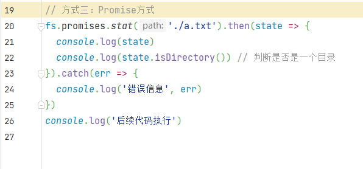

## node-study

#### `V8引擎怎么运行js代码的？`

V8引擎用于chrome和node，他可以独立运行，也可以嵌入到C++等应用程序。

`执行js的流程`


`Parse模块`: Parse模块会将js代码转换成为AST，这是因为解释器不认识js代码。如果函数没有调用，那么是不会被转换成AST的

`Ignition`：解释器，会将AST转换成为ByteCode(字节码),同时会收集TurboFan优化所需要的信息(比如函数参数的类型信息，有了类型信息才能进行真实的运算) 

`TurboFan`：编译器，可以将字节码编译为CPU可以直接执行的机器码

#### `node的REPL`

什么是REPL？

​	REPL是一个简单的，交互式的编程环境。我们在浏览器的控制台就相当于一个REPL，可以输入简单的js代码进行运行


我们在vscode的终端中直接输入node敲回车也能够打开一个REPL的环境进行执行一些简单的js代码

#### `使用nvm进行版本管理`

安装nvm前提必须先卸载原本的node

然后在https://github.com/coreybutler/nvm-windows/releases选择nvm-setup.zip进行下载

下载完成后直接安装，并为nvm配置镜像

```
node_mirror: https://npm.taobao.org/mirrors/node/
npm_mirror: https://npm.taobao.org/mirrors/npm/
```

然后使用`nvm list available`查看可用的node版本

安装使用`nvm install [version]`，卸载使用`nvm uninstall [version]`

安装完成后使用`nvm use [version]`切换到指定的版本

如果`nvm use [version]`报错`exit status 1:乱码`

则(使用管理员权限的PowerShell打开)输入`chcp 65001`之后再次输入`nvm use [version]`则可以把乱码解析

#### `给node传递参数`

在浏览器中，有个顶级对象叫window。里面包含了很多的东西。但是在node里，我们打印window，他是一个undefined。而在node中，他的顶级对象是是什么呢？

`process`：我们可以在js文件中打印process，然后使用node运行。这个就是node中的顶级对象

例如我们输入`node index.js hwh age=18`这样的命令，则我们传递的参数去哪里了呢？

想这样的传递参数的方式，我们可以在process.argv中可以看到所传递的参数。他是一个数组，原本就会内置有两个元素，node程序所在路径和当前运行的文件的路径


#### `node中的全局对象`

`__dirname`：获取当前文件所在路径

`__filename`：获取当前文件所在路径及当前文件名

`process`：提供了很多关于node进程中相关的对象

`console`：内置有很多的方法

还有很多定时器的全局对象

`global对象`：类似于浏览器的window对象，但是里面内置了很多的属性与方法。与window对象不同的地方在于

```javascript
window:
	var name = 'hwh'
	console.log(window.name) // hwh
	
global:
	var name = 'hwh'
	console.log(global.name) // undefined

// 在全局声明的一个变量或函数，都会被添加到window中。但是node环境下并不会添加到global对象中
```

### `CommonJS`

CommonJS是一个规范，最早是提出来在浏览器以外的地方使用的。后来再node上也对CommonJS进行了支持和实现。让我们在开发node的过程中，可以更方便的进行模块化开发

在node中，每个js文件都是单独的一个模块，这个模块中包括CommonJS的核心变量：`exports`，`module.exports`，`require`。我们可以使用这些变量方便的进行开发、

`exports和module.exports`：可以对模块中的内容进行导出，实际上导出的是module.exports。在node源码里`module.exports = exports`。所以默认他们是相等的

`require`：导入其他模块中的内容

所谓的导出就是：exports默认是一个空对象，而上面保存的是这个空对象的引用地址。当我们`require`导入这个文件的时候，返回的就是`exports`的引用地址。

### `require`

require导入模块的细节：

1. 查找规则
   - 比如我们导入一个核心模块`const path = require('path')`，会直接返回这个核心模块，停止查找
   - `require`函数内的字符串是以./或../或/开头的，说明查找的是本地文件或目录
     - 如果没有后缀名，会按照如下顺序进行查找
       - 直接查找文件X -> 查找X.js -> 查找X.json -> 查找X.node
     - 如果使用上述方法没有找到，则把X当作一个目录然后按照如下顺序进行查找
       - 查找X/index.js -> 查找X/index.json -> 查找X/index.node
     - 如果上述两种方法都没有找到，则报错
   - 直接是一个X(没有路径),并且X不是一个核心模块
     - 在我们每个文件中都会有一个module模块，这个module模块内会包含当前文件一直到根目录的node_modules文件的路径，当我们导入的X不是一个核心模块也没有路径时，就会到node_modules里面找
     - 
     - 上述方式找不到时就会报错
   - 上述查找规则是node默认的顺序，我们可以在配置文件中修改查找的顺序
2. 模块的加载过程
   1. 模块在被第一次引入时，模块内的代码会被运行一次
   2. 模块被多次引入时，会被缓存，最终只会运行一次
      - 为什么只会加载一次？因为每个模块的module对象都有一个loaded属性，当第一次加载时，就被设为了true，这样第二次引用的时候，看到值为true，则去查找缓存
   3. 如果有循环引入，那么会从根节点开始，找到依赖的模块，并进行深度优先搜索的方式加载，然后缓存
      - 深度优先搜索是什么意思？就是我们在A.js里面引用了B.js，在B.js中引用了C.js，C.js中引用了A.js。那么首先加载A.js时执行到`require导入函数时`，则加载B，然后加载C，但是在C里边不会在运行A，因为A.js的module.loaded值为true，代表已经被加载过了，此时使用缓存就可以了
   4. `require函数是同步加载的`

### `ES Module加载过程解析`

CommonJS是同步的，但是ES Module是异步的。而且export {} 导出的不是一个对象。在解析阶段，js引擎看到export导出内容时，就会创建一个环境模块记录，并且这个记录是实时的。

`注意点`

1. 如果导出的不是一个 引用值
   1. 我们在导出文件修改变量时，导入文件对应的变量也会实时更新。但是导入文件不能修改这个变量，因为在环境模块记录中。这个变量的已经改成了常量
2. 如果导出的是一个引用值
   1. 那我们在导入导出文件都可以修改，但是不能修改引用地址。可以修改里边的属性或方法
   2. 

#### `node对ES Module的支持`


我们像这样使用是会报错的，为什么呢？

1. 因为在node中默认支持的是CommonJS，而ES Module需要在package.jon中配置`type: module`
2. 或者文件名使用`.mjs`结尾，表示这是ES Module的模块

#### `ES Module与CommonJS的相互使用`

1. ES导出，CJS导入
   1. 
   2. 会报错，CJS是同步加载的，而ES必须经过静态分析等，无法在这个时候执行javascript代码。起码在node环境这种方式是不支持的，其他环境有可能会支持
2. CJS导出，ES导入
   1. 
   2. node环境中支持这种方式

### `常见的模块`

#### `path`

path.resolve用于拼接路径，为什么不用字符串拼接的方法去拼接路径呢？

​	因为在不同的电脑中，有的使用 \ 或 \\ \ 或 /。所以为了避免出现bug。我们可以使用node中的path模块的resolve方法，他会自动给我们转换为电脑所适用的方法


其他api


### `fs`

fs是node内置的文件系统，为什么要内置一个文件系统呢？

​	因为在不同的操作系统，他们对文件的操作都是有差异的。所以为了兼容性，node自己封装了一套文件系统

fs中有很多的api，但是这些api大多数都提供了三种操作方式

1. 同步操作文件
   - 代码会被阻塞
   - 
   - 会先打印state，再往后执行
2. 异步回调函数操作文件
   - 代码不会被阻塞，需要传入回调函数，得到结果时，回调函数被执行
   - 
3. 异步promise操作文件
   - 代码不会被阻塞，通过fs.promises调用方法操作，会返回一个promise
   - 

以上方式都是获取一个文件的状态，返回值为


#### `文件描述符`

文件描述符是什么？

​	在POSIX系统上，对于每个进程，内核都维护着一张当前打开的文件和资源的表格。每个打开的文件都分配一个称为文件描述符的简单的数字。在系统层，所有文件系统操作都使用这些文件描述符来标识和跟踪每个特定的文件

为了简化用户的工作，node为所有打开的文件分配一个新的文件描述符。使用`fs.open`方法来分配。

一旦被分配，则文件描述符可用于从文件读取数据，向文件写入数据，或请求关于文件的信息等


#### `文件的读写`

如果我们希望对文件内容进行操作，这个时候可以使用文件的读写

`fs.readFile`：读取文件内容

1. 第一个参数为文件路径，第二个参数可以配置flag,encoding，第三个是一个回调
   1. `flag`: 写入的方式
   2. encoding：字符的编码
   3. 

`fs.writeFile`：写入内容

1. 

#### `文件夹的操作`


### `events`

events是一个事件体系，可以监听，发出或取消事件等相关的操作


#### `node实现复制功能脚本`

需要在执行node命令中输入被拷贝文件夹(或是文件)与需要拷贝的文件夹

```javascript
// copy一个文件夹到指定
const path = require('path')
const fs = require('fs')

// 读取到传入的指定被拷贝文件夹 与新文件夹
const oldFilePath = path.resolve(process.argv[2])
const newFilePath = path.resolve(process.argv[3])

// 判断目前有没有新文件夹，没有则创建一个空文件夹
if (!fs.existsSync(newFilePath)) {
  fs.mkdir(newFilePath, err => {
    if (err) {
      console.log('创建新文件夹出现错误：', err)
    }
  })
}

function copyFiles(originFilePath, copyFilePath) {
  
  // 同步读取文件状态
  const state = fs.statSync(originFilePath)
  
  // 判断当前需要copy的是文件还是文件夹
  if (!state.isDirectory()) {
    // 是文件则直接获取文件名 然后与新目录做拼接然后copy
    const basename = path.basename(originFilePath)
    fs.copyFileSync(originFilePath, path.resolve(copyFilePath, basename))
    return;
  }

  // 读取文件夹下的文件
  fs.readdir(originFilePath, {withFileTypes: true}, (err, files) => {
    for (let file of files) {
      // 判断当前项是不是文件
      if (!file.isDirectory()) {

        // 获取旧文件所在路径
        const originFile = path.resolve(originFilePath, file.name)

        // 新文件保存路径
        let copyFile;

        if (path.extname(file.name) === '.js') {

          // basename获取文件名及扩展名，extname获取扩展名 然后用split分割，得到文件名不带扩展名
          const copyName = path.basename(file.name).split(path.extname(file.name))[0]
          // 最后再把扩展名改为.jsx
          copyFile = path.resolve(copyFilePath, copyName + '.jsx')
        } else {
          // 扩展名不为.js时，直接拼接
          copyFile = path.resolve(copyFilePath, file.name)
        }


        // 同步copy文件
        fs.copyFileSync(originFile, copyFile)
      } else {
        // 如果不是文件那就获取到旧文件夹路径，创建一个新的文件夹并递归
        const copyDirPath = path.resolve(copyFilePath, file.name)
        const originDirPath = path.resolve(originFilePath, file.name)
        fs.mkdir(copyDirPath,err => {
          if (err) {
            console.log('创建新文件夹出现错误：', err)
          }
        })

        copyFiles(originDirPath, copyDirPath)
      }
    }
  })
}

copyFiles(oldFilePath, newFilePath)


```

### `包管理工具`

如果将我们的代码给分享出去供别人使用呢？

可以将我们的代码上传到GitHub，或者使用专业的包管理工具，然后将代码发布到特定的位置，供别人下载。目前可以通过npm来实现这一方式

#### `npm`

通过npm管理的包可以在https://www.npmjs.org进行查看，搜索

则我们通过npm发布的代码是保存在registry上的。

当我们使用在终端输入`npm init -y`时，会在此文件夹下创建一个package.json文件作为项目配置文件

##### `package.json常见属性`

1. name: 项目的名称
2. version：当前项目的版本号
3. description：项目的基本描述
4. author：作者相关信息
5. license：开源协议(发布时需要用到)
6. private：记录当前项目是否是私有的。值为true时，使用发布命令时不能发布出去的
7. main：设置程序的入口，这一入口主要应用于别人使用我们的包时，`const axios = require('axios')`的入口。与webpack设置的入口是两回事
8. script：配置脚本命令，以键值对的方式存在，配置后以`npm run key`的方式运行。有一些固定的key可以省略run。例如start，build，test等
9. dependencies：指定无论是开发环境还是生产环境我们都需要依赖的包
10. devDependencies：指定在生产环境不需要依赖的包
11. engines：用于指定node和npm的版本，在安装的过程中，会先检查对应的引擎版本，不符合则报错
12. browserslist：用于配置打包后的js代码兼容浏览器的情况

##### `版本管理`

通常我们安装的包的依赖版本都会出现~1.2.3或^1.2.3他的规范主要是X.Y.Z：

1. X：主版本号，当做了不兼容的API的修改时，需要修改这个值
2. Y：次版本号，当做了向下兼容，且有新功能新增时，需要修改这个值
3. Z：修订号：没有新功能，修复了之前的版本的bug时需要修改

^表示X是不变的，y和z永远安装最新的版本

~表示y和x保持不变，z永远安装最新的版本

##### `npm install原理`


`解析`

检测是有否package-lock.json文件： 

1. 没有lock文件
   1. 分析依赖关系，这是因为我们可能包会依赖其他的包，并且多个包之间会产生相同依赖的情况；
   2.  从registry仓库中下载压缩包（如果我们设置了镜像，那么会从镜像服务器下载压缩包）； 
   3. 获取到压缩包后会对压缩包进行缓存（从npm5开始有的）； 
   4. 将压缩包解压到项目的node_modules文件夹中。然后生成package-lock.json文件
2. 有lock文件 
   1. 检测lock中包的版本是否和package.json中一致（会按照semver版本规范检测）； 
      1. 不一致，那么会重新构建依赖关系，直接会走顶层的流程；
   2. 一致的情况下，会去优先查找缓存 
      1. 没有找到，会从registry仓库下载，直接走顶层流程； 
   3. 查找到，会获取缓存中的压缩文件，并且将压缩文件解压到node_modules文件夹中；

##### `package-lock.json文件解析`

1. name：项目的名称
2. version：项目的版本
3. lockfileVersion：lock文件的版本
4. requires：使用requires来管理模块的依赖关系
5. devDependencies：项目的依赖
6. resolved：在registry仓库的下载地址
7. integrity：从缓存中获取索引，在通过索引去获取压缩文件，最后解压到当前项目的node_modules。终端输入`npm config get cache`就能查看到缓存路径，然后找这个文件
8. 

### `实现自己的脚手架工具`

首先得创建一个入口文件`index.js`文件。然后`npm init -y`生成package.json文件。然后在入口文件添加指令

`#!/usr/bin/env node`。修改package.json命令`bin: { hwh: index.js }`。最后输入npm link。此时再输入终端再输入`hwh`就能识别了

1. `#!/usr/bin/env node`：#！表示这个文件可以当作脚本运行，怎么运行呢？`/usr/bin/env node`这个的意思就是用node来执行这个文件，去用户(usr)的安装根目录`bin`下的env环境变量中去找
2. `bin: {hwh: index.js}`：添加hwh的环境变量

安装`commander`


#### `自定义命令`

```javascript
const program = require('commander')

const createCommands = () => {
  program
      .command('create <project> [others...]') // 创建指令 create表示指令 <project>是参数，<>表示必选的，project则是参数名称 []表示可选的 ...表示可变的。...只能用于最后一个参数
      .description('clone a repository into a folder') // 指令描述
      .action((project, others) => {
        // project是终端输入的必选的参数 others则是终端输入的可选可变的参数，是一个数组
        console.log(project, others)
      })
}

module.exports = createCommands

// 随后在index.js文件导入这个函数，使用即可
例如在终端输入 hwh create demo abc cba
此时log的project为 demo others为[abc,cba]
```

#### `配置下载模板`

```javascript
const {promisify} = require('util') // 将一个普通函数转换为promise
const {vueRepo} = require('../config/repo-config') // 下载地址
const download = promisify(require('download-git-repo')) // 将原本的函数转为promise
const createProjectAction = async (project) => {
  // 1. clone项目模板
  await download(vueRepo, project, {clone: true}) // project表示clone到哪个目录，clone：true表示也clone git记录等
  // 2. 执行 npm install
  // 3. 运行npm run serve
  // 4. 打开浏览器
}

module.exports = {
  createProjectAction
}


// repo-config
let vueRepo = 'direct:https://github.com/coderwhy/hy-vue-temp.git'

module.exports = {
  vueRepo
}

```

##### `还配置了创建组件，npm install等命令。具体看HWH_CLI文件夹`

### `BUffer`

在计算机中，所有的内容最终都会被转换成为二进制来表示，而JavaScript是不能处理二进制的，但是node需要与二进制打交道。所以就提供了一个buffer的全局类，供js去操作二进制数据

那么buffer是怎么储存二进制数据的呢？

​	我们可以把它当作一个数组，这个数组中的每一项可以保存8位的二进制。而8位为一个单元

​	所以1个字节=8比特

```javascript
const message = 'hello'
const msg = '你好啊'
// 1. 编码 使用new Buffer.from方法可以把字符串编码成buffer, 第二个参数为编码方法 默认为utf8
const buffer = new Buffer.from(message)

// 2. 解码 使用toString()进行解码 默认解码方式为utf8
const str = buffer.toString()
console.log(str)

// 编码和解码的方式必须一直，否则就会变成乱码
const buffer2 = new Buffer.from(msg, 'utf16le')
const str2 = buffer2.toString('utf16le')
console.log(str2)

```

#### `创建空的buffer`

```javascript
const buffer = Buffer.alloc(8) // 创建一个空的buffer 里面的数据都为 00
buffer[0] = 11 // 可以通过索引的方式去修改buffer
console.log(buffer)

```

#### `读取buffer并修改`

```javascript
const fs = require("fs");
const sharp = require('sharp')
fs.readFile('./xiaochou2.jpg', (err, data) => {
  console.log(data) // data是一个buffer 没有指定解码方式 默认为encoding: utf-8
})

// 使用sharp三方库对buffer做一些修改，然后写入文件
sharp('./xiaochou2.jpg') // 读取文件 返回buffer
    .resize(200, 200) // 修改大小
    .toFile('./xc.jpg', (err, info) => {
      console.log(info) // 写入文件
    })

```

### `事件循环`

什么是事件循环？

1. 可以把事件循环理解成JavaScript和浏览器和node之前的一个桥梁，他们之间通过回调函数进行沟通

#### `进程和线程`

进程和线程是两个概念

1. 进程：计算机已经运行的程序
   1. 我们每启动一个应用程序，就会默认启动至少一个进程
2. 操作系统能够运行调度的最小单位
   1. 每一个进程中，都会启动一个线程来执行程序中的代码，这个线程称之为主线程
3. 所以我们可以说进程是线程的容器

操作系统是如何做到同时让多个进程同时工作的呢？

这是因为CPU的运算速度非常快，它可以快速的在多个进程之间迅速切换，对于我们来说是感知不到这种切换的

我们经常说JavaScript是单线程的，但是它应该也有自己的容器：浏览器或node

浏览器是多进程的，当我们开启一个tab页时，就会打开一个进程，每个进程又有很多线程，其中就包括JavaScript的线程。

但是JavaScript的代码执行是在一个单独的线程中执行的，这就意味着，JavaScript代码，在同一时刻，只能做一件事情，如果这件事情是非常耗时的，这就意味着当前的线程被阻塞

##### `JavaScript执行过程`

它里边存在于一个调用栈，然后一行一行的代码执行，按照先进后出的顺序，执行完一个函数就会弹出调用栈，而如果我们执行了异步操作(setTomeout, ajax请求等)，他不会阻塞线程吗？

setTimeout调用了web api，会在合适的时机，把回调函数加入到浏览器的事件队列中，这个事件队列是先进先出的。也就是当执行到定时器任务时，会把它弹出栈，加入到浏览器事件队列，然后到合适的时机再入栈，执行回调

##### `宏任务队列和微任务队列`

事件循环中并非只会维护着一个队列，事实上是有两个队列的

1. 宏任务队列：Ajax，setTimeout，setInterval，dom监听等
2. 微任务队列：promise的then回调，mutation observer api queue microtask等

执行顺序：

1. 首先执行顶层script宏任务(同步代码)，遇到微任务或宏任务时，先推入对应的事件队列
2. 执行完同步代码后，执行微任务队列，如果此时的微任务中有宏任务或微任务时，也是推入对应的事件队列
3. 执行完微任务后，执行宏任务，如果里边有微任务，那么执行完当前这一个宏任务，会先去执行微任务，确保微任务队列内没有任务之后才会继续执行宏任务

#### `node架构`

浏览器的event loop是根据HTML5定义的规范来实现的，不同的浏览器有不同的实现，而node中是由libuv实现的

libuv中主要维护了一个event loop和worker threas(线程池)，event loop负责调用系统的一些其他操作：文件的IO，network，child-process等

##### `阻塞IO和非阻塞IO`

我们任何程序中的文件操作都是需要进行系统调用(操作系统的文件系统)，事实上对文件的操作，是一个操作系统的IO操作

1. 阻塞式调用：调用结果返回之前，当前线程处于阻塞态(阻塞态CPU是不会分配时间片的)，调用线程只有在得到调用结果之后才会继续执行
2. 非阻塞式调用：调用执行之后，当前线程不会停止执行，只需要过一段时间来检查一下有没有返回结果即可

非阻塞IO的问题：如果我们没有读取到结果，那就意味着我们需要频繁的去确定读取到的数据是否是完整的，这个过程我们称之为轮询操作

而这个轮询操作的工作就需要libuv的线程池来执行，线程池会负责所有相关的操作，并且通过轮询等方式等待结果，当获取到结果时，就可以将对应的回调放到事件循环中，事件循环就可以负责接管后续的回调工作，告知JavaScript应用程序执行对应的回调函数

##### `阻塞和非阻塞，同步和异步的区别`

- 阻塞和非阻塞是对应被调用者来说的，例如操作系统就是被调用者
- 同步和异步是对于调用者来说，我们自己的程序就是被调用者

libuv采用的就是非阻塞异步IO的调用方式

### node事件循环阶段

一次完成的事件循环Tick会分成很多个阶段：

1. 定时器：本阶段执行已经被setTimeout和setInterval的调度回调函数
2. 待定回调：对某些系统操作执行回调，比如TCP连接时接收到ECONNREFUSED
3. idle，prepare：仅系统内部使用
4. 轮询：检索新的IO事件，执行与IO相关的回调
5. 检测：setImmediate回调函数在这里执行
6. 关闭回调函数：一些关闭的回调函数，如监听的close

#### node的微任务和宏任务

node的事件循环更复杂，它也分为微任务和宏任务

1. 宏任务：setTimeout,setInterval,IO事件，setImmediate，close事件
2. 微任务：promise的then回调，process.nextTick，queueMicrotask

执行的顺序：

1. next tick queue：process.nextTick
2. other queue：Promise的回调，queueMicrotask
3. timer queue：setTimeout，setInterval
4. poll queue：IO事件
5. check queue：setImmediate
6. close queue：close事件

### Stream

stream：流。程序中的流，就是当我们在一个文件读取数据时，文件的二进制数据会源源不断的被读取到我们的程序中，而这一连串的字节，就是我们程序中的流

所以我们可以这样理解流：

1. 是连续字节的一种表现形式和抽象概念
2. 流应该是可读的，也是可写的

而我们之前使用的readFile或者writeFile方式读写文件，为什么还需要流呢？

- 直接读写文件的方式，虽然简单，但是无法控制一些细节的操作
- 比如从什么位置开始读，读到什么位置，一次性读多少个字节
- 读到某个位置后，暂停读取，某个时刻恢复读取
- 或者这个文件非常大，比如一个视频文件，一次性全部读取并不合适

事实上node中有很多对象是基于流实现的，nodejs中有四种基本流类型：

1. writable：可以向其写入数据的流(例如fs.createWriteStream)
2. readable：可以从中读取数据的流(例如fs.createReadStream)
3. Duplex：同时为Readable和writeable的流(例如net.socket)
4. Transform：Duplex可以在写入和读取数据时修改或者转换数据的流(例如zlib.createDeflate)

#### readable的使用

```javascript
const fs = require('fs')

// 传统的读取文件 这种方式一次性将一个文件中所有的内容都读取到程序中
// fs.readFile('./foo', (err, data) => {
//   console.log(data) // buffer
// })

// 创建一个流
const read = fs.createReadStream('./foo', {
  start: 2, // 开始位置
  end: 6, // 结束位置
  highWaterMark: 2 // 一次读取多少
})

// 监听读取到数据
read.on('data', (data) => {
  console.log(data)

  read.pause()

  setTimeout(() => {
    read.resume()
  }, 2000)
})

read.on('open', (fd) => {
  console.log('文件被打开')
})

read.on('end', () => {
  console.log('文件读取结束')
})

read.on('close', () => {
  console.log('文件被关闭')
})

```

#### writable的使用

```javascript
const fs = require('fs')

// 传统方式写入
// fs.writeFile('./bar', '写入的内容', err => {
//   if (err) return console.log('写入失败')
// })

// writable的使用
const writer = fs.createWriteStream('./bar', {
  flags: 'a',
  start: 2
})

// writer.write('hwh', error => {
//   if (error) return console.log('写入失败')
// })

// 如果没有执行这个函数，管道是一直开启的
// writer.close()

// 没有调用close，finish和close都不会触发
writer.on('finish', () => {
  console.log('文件写入结束')
})

writer.on('close', () => {
  console.log('文件关闭')
})

// end事件相当于做了write函数和close函数
writer.end('hello hwh')
```

#### pipe的使用

```javascript
const fs = require('fs')

const reader = fs.createReadStream('./foo')
const writer = fs.createWriteStream('./abc')

// 拿到读取流，然后直接调用写入流的方法把数据写入
// reader.on('data', (data) => {
//   console.log(data)
//   writer.end(data)
//
// })

// pipe方法可以将读取到的输入流手动的放到输出流中进行写入
reader.pipe(writer)

```

